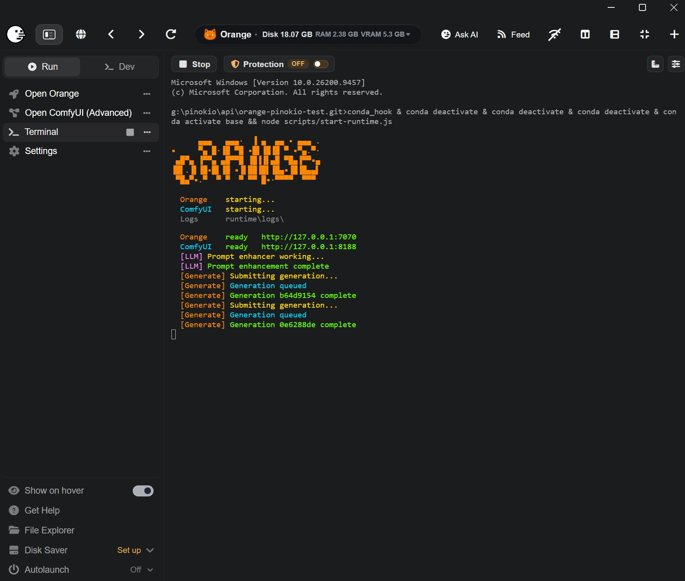

# Orange Pinokio Launcher

  

This is the Pinokio launcher for [Orange](https://github.com/saintbrodie/Orange), a simple frontend for engineered **ComfyUI** workflows.

The launcher can either install a complete Orange + ComfyUI stack or run Orange against a ComfyUI you already manage somewhere else.

## Install choices

### Orange + ComfyUI

This is the easiest local setup. Pinokio installs:

- `app/` for Orange
- `app/env/` for the Orange Python environment
- `comfyui/ComfyUI/` for the managed ComfyUI checkout
- `comfyui/ComfyUI/comfy-env/` for the ComfyUI Python environment
- `runtime/` for launcher state and logs

Orange and ComfyUI start together. Orange gets the managed ComfyUI and model paths automatically, so first-run setup does not ask you to hunt for folders.

The launcher uses the Orange-tested ComfyUI revision declared by Orange. ComfyUI updates are explicit and separate from normal Orange updates.

### Orange Only

Choose this if you already use ComfyUI through Stability Matrix, another launcher, another machine, or a remote server.

Orange connects through the ComfyUI API and leaves that external install alone. It does not change the external ComfyUI Git revision, Python environment, or packages.

Managed installs also include **Start Orange Only (Use Existing ComfyUI)**. That lets you temporarily use another ComfyUI without deleting the bundled one.

## Running Orange

When Orange is running, Pinokio exposes:

- **Open Orange**
- **Terminal**
- **Open ComfyUI (Advanced)** when the managed ComfyUI is running

The terminal stays quiet when idle and shows useful activity when something is happening, including startup state, LLM prompt enhancement, generation queueing, completions, warnings, and failures.

Full child-process logs are saved under `runtime/logs/`. Set `ORANGE_VERBOSE_LOGS=1` if you want the raw live output instead.

## Port conflicts

Managed startup checks ports before launching anything.

- `7070` must be free for Orange.
- `8188` must be free when Pinokio is starting the managed ComfyUI.

If another ComfyUI is already using `8188`, close it and start the managed stack again, or choose **Start Orange Only (Use Existing ComfyUI)**.

## First run

Orange handles tool setup in the browser. It scans the connected ComfyUI first, then shows the curated tools that can be added.

The curated packs are optional. Orange can finish setup with zero curated tools installed, and compatible models that are already present can be reused instead of downloaded again.

## Updating

The Pinokio menu keeps Orange updates and ComfyUI updates separate:

- **Update Orange** updates the launcher, Orange source, and Orange Python requirements.
- **Update ComfyUI (Orange-tested)** moves the managed ComfyUI to the revision Orange currently targets.
- **Update ComfyUI to Latest (Advanced)** opts into current upstream ComfyUI.
- **Rollback ComfyUI** returns to the previous recorded revision after a managed runtime change.
- **Repair Dependencies** resyncs the selected install path without deleting Orange data.

Normal Orange updates do not silently advance the managed ComfyUI revision.

## Resetting

**Factory Reset (Deletes Local Data)** removes the Orange environment and local Orange data. On managed installs it also removes the bundled ComfyUI and its models.

Back up anything you want to keep before using Factory Reset.

## Requirements

- [Pinokio](https://pinokio.computer)
- A system supported by ComfyUI if you use the managed Orange + ComfyUI install
